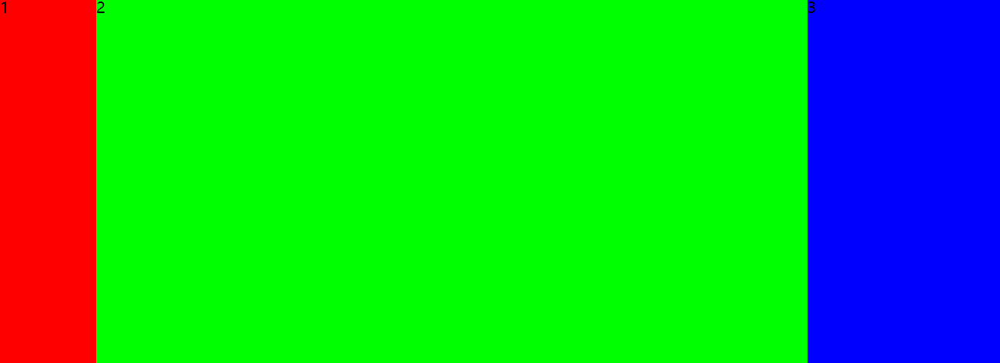
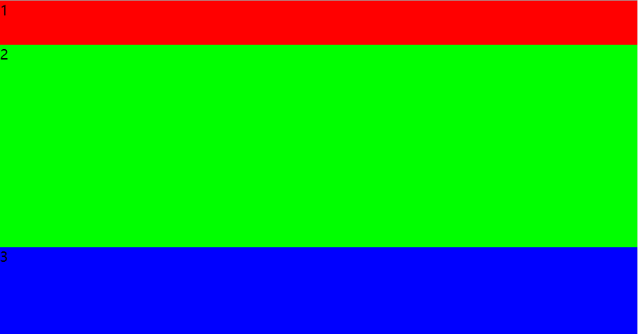
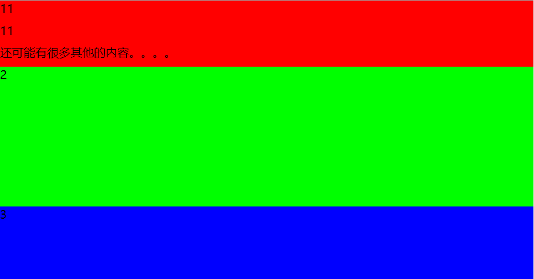

## ie10 以下flex布局替换方案


#### 横向排列



```
<style>
    #container{
        width: 100%;
        height: 100%;
        overflow: hidden;
        display: table-row;
    }
    #a{
        height: 100%;
        width: 100px;
        background: #f00;
        display: table-cell;
    }
    #b{
        height: 100%;
        /* flex: 1; */
        display: table-cell;
        background: #0f0;
    }
    #c{
        width: 200px;
        height: 100%;
        display: table-cell;
        background: #00f;
    }
    .box{
        width: 100%;
        height: 100%;
        display: table;
    }
</style>


<div class="box">
    <div id="container">
        <div id="a">1</div>
        <div id="b">2</div>
        <div id="c">3</div>
    </div>
</div>

```

#### 纵向的布局

头和脚的高度固定中间的内容自适应

```
<style>
    .box{
        width: 100%;
        height: 100%;
        display: table;
    }
    .container {
        width: 100%;
        height: 100%;
        display: table-row-group;
    }
    .row {
        width: 100%;
        display: table-row;
    }
    .a{
        height: 50px;
        background: #f00;
    }
    .b{
        background: #0f0;
        height: 100%;
    }
    .c{
        background: #00f;
        height: 100px;
    }
</style>

<div class="box">
    <div class="container">
        <div class="a row">1</div>
        <div class="b row">2</div>
        <div class="c row">3</div>
    </div>
</div>
```

#### 纵向布局

一部分根据内容撑开，另一部分剩余的内容自适应。


```
<style>
    .box{
        width: 100%;
        height: 100%;
        display: table;
    }
    .container {
        width: 100%;
        height: 100%;
        display: table-row-group;
    }
    .row {
        width: 100%;
        display: table-row;
    }
    .a{
        min-height: 30px;
        background: #f00;
    }
    .a p {
        height: 30px;
    }
    .b{
        background: #0f0;
        height: 100%;
    }
    .c{
        background: #00f;
        height: 100px;
    }
</style>

<div class="box">
    <div class="container">
        <div class="a row">
            <p>11</p>
            <p>11</p>
            <p>还可能有很多其他的内容。。。。</p>
        </div>
        <div class="b row">2</div>
        <div class="c row">3</div>
    </div>
</div>
```